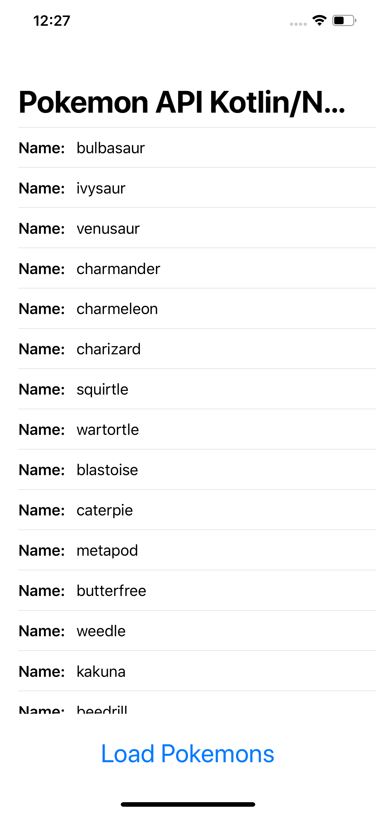
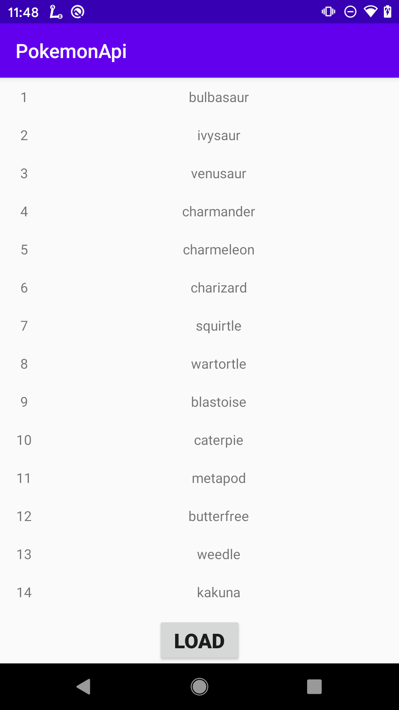

# PokeAPI-multiplatform
## iOS and Android mobile clients based on Kotlin/Native (Multiplatform)

| iOS  | Android |
| ------------- | ------------- |
|  |  |

# Backend
* https://pokeapi.co/

# Reference
* https://kotlinlang.org/docs/reference/native-overview.html
* https://github.com/JetBrains/kotlinconf-app
* https://dev.to/kuuurt/maximizing-code-sharing-between-android-and-ios-with-kotlin-multiplatform-54h8
